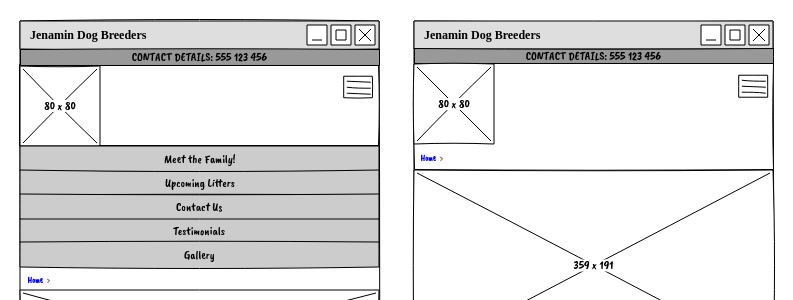
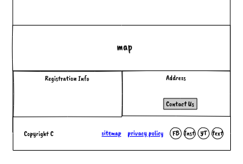
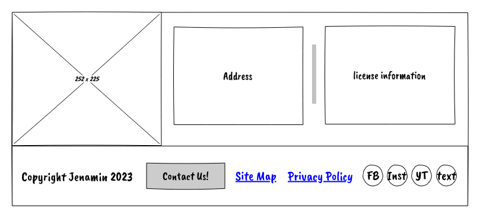
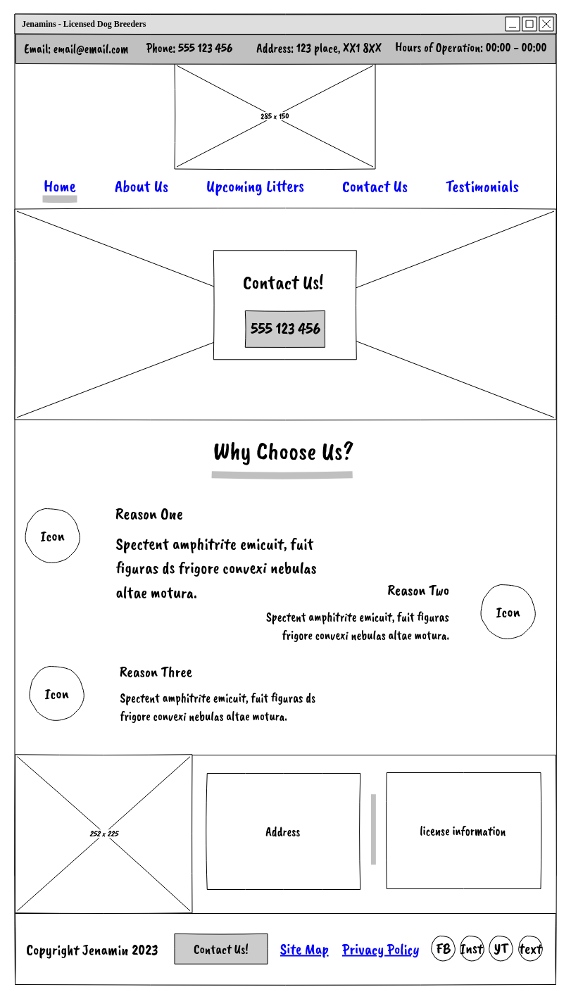
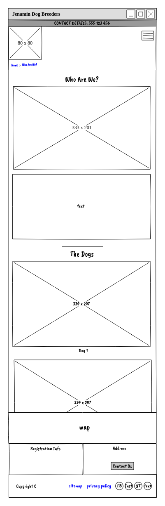

# Milestone Project :one:

---

## :world_map: Strategy

---

### Project Goals

This is my milestone one project for the
[Code Institute's](http://www.codeinstitute.net) _'Level 5 Diploma in Web
Application Development'_. The goal is to demonstrate my ability to utilise HTML
and CSS, including CSS frameworks, to create a small, responsive, well-designed
and well-implemented website for a business, fictional or otherwise. For this
assignment I have chosen to create the webpage for my mother-in-law's dog
breeding business, 'Jenamins'.

#### User Goals

- Easy to find contact and location information
- Lots of pictures of cute puppies
- Gain insight into the running of the business, levels of professionalism,
  approachability and other factors relating to the decision to buy a puppy

#### Site Operator Goals

- Connect with more potential dog owners looking to purchase a puppy
- Promote the business more broadly
- A place to direct people looking for information
- Provide a way of potential customers to register their interest
- Show the customer what makes this company special
- Promote the family run and professional nature of the business
- Provide customers with information on currently available puppies and upcoming
  litters

#### Developer Goals

- Develop a site that satisfies the distinction requirements of the Code
  Institute
- Develop a site that satisfies the Goals of the Users and Operator as
  determined by the User Stories and Goals
- Use plain HTML, CSS and frameworks such as Bootstap to create a technically
  interesting and aestetically appealing site
- Use frameworks where necessary so as to not reinvent the wheel
- Create a responsive website that looks appealing on a variety of screensizes
  and devices
- Build a performant and efficient site, benchmarked used tools such as
  lighthouse, that is viewable on all modern browsers and devices

---

## :earth_africa: Scope

---

### User Experience

#### Target Audience

- Adults 18 and up
- Customers looking to buy a new puppy
- People interested in breeding their dogs
- People looking for pictures of cute puppies!

#### User Requirements and Expectations

- Easy navigation, plenty of breadcrumbs, back-to-the-top links/widgets and
  other quality of life features
- Accessible for colourblind, visually impared, and other users with
  accessibility needs
- All functionality presented works as expected and as intended
- Quick and easy access to contact details and location
- Plenty of images and a friendly aethetic presentation -Simple to use with
  logical flow and clear and straightforward navigation

#### User Stories

##### - First Time User

1. As a first time user I want to know who this company is
2. As a first time visitor I want to know what breeds of dogs Jenamin works with
3. As a first time user I want a smooth experience with easy access to the most
   important information (contact and location details)
4. As a first time user I want to see many pictures of puppies
5. As a first time user I want to not be frustrated with the layout or design of
   the site
6. As a first time user I would like to be easily able to contact the business
   with questions

##### - Returning User

1. As a returning user I would like to see new/different pictures
2. As a returning user I would like easy access to the Upcoming Litters page as
   I am looking for one in particular
3. As a returning user I would like to be able to find the business on social
   media
4. As a returning user I would like easy access to the contact and location
   details
5. As a returning customer I would like easy access to the various official
   information, registration numbers etc.

##### - Site Owner

1. As the site owner I would like to connect with potential customers and other
   breeders more easily and more cheaply
2. As the site owner I want to be able to easily see when a potential customer
   has contacted me through the website
3. As the site owner I would like the site to be well optimised for SEO in order
   to increase visibility
4. As the site owner I want potential customers to be able to contact/find us
   easily
5. As the site owner I want to make sure customers are never lost on my website

#### Identified tasks/needs the website should fulfil

| Task/Need                               | Importance: \*/5 |
| --------------------------------------- | ---------------- |
| Browsing pictures                       | 4                |
| Accessing contact details               | 5                |
| Discovering location                    | 5                |
| Finding out more about the company      | 3                |
| Gaining more information about the dogs | 4                |
| Information on upcoming litters         | 5                |
| Finding on Social sites                 | 3                |
| Ability to contact through website      | 3                |
| Easy navigation                         | 5                |
| Finding registration info               | 5                |

#### Accessibility

Accessibility needs should be considered and aria tags, semantic HTML tags, and
alt tags for images should all be clear descriptive and follow the w3
conventions.

Color palletes will be assessed for color-blind friendliness, and adjusted if
neccessary.

The structure of each page should be logical and allow keyboard navigation and
be screen-reader friendly

Site should contain a sitemap to aid with accessibility

---

## :bricks: Structure

---

The site needs to be structured in an intuitive and straight-forward way.
Constantly visible, consistent, navigation links; links back to the top of the
page for long pages, and other quality of life navigation features are
important. Site will be using a tree-style Information Architecture with links
back and forward available to the user at all times via the floating nav element
and/or the footer as well as a sitemap and breadcrumb trail indicating the users
current position on the site.

Links and navigation should be clear and unambiguous, interactive to highlight
them visually, and well-labelled to help with accessibility.

The website should consist of the following pages:

- **Landing page** - with a large hero image, some introductory content, nav bar
  and footer with social links and contact details. The nav bar and footer
  elements will be consistent and accessible across all pages of the site.

- **About Us** - A page detailing the staff and dogs involved,the story of the
  company and the owners, why and how it was started, credentials and other
  pertinent information.

- **Upcoming Litters** - A page to announce the latest news and for returning
  vistors to get updates.

- **Testimonials** - A page for customer testimonials, of which there are many,
  so smart presentation will be important. Combine this with the previously
  mooted gallery page.

- **Contact Us** - A page dedicated to contact and location information
  including a map and containg a styled webform to contact the business.

- **404 Page not found** - for mistypes/broken links

- **Privacy Policy** - link in footer and on contact page

The site should also make use of a 404 page that redirects the user back the
landing page, and a favicon to allow users to easily recognise the site amongst
bookmark lists.

Pages should be responsive and designed well for the three most common screen
sizes of phone, tablet, and desktop:

- 360x640px
- 768x1024px
- 1280x720px

Each page should consist of the same nav bar and footer, ensuring a consistent
User Experience.

The **Nav Bar** should contain the following elements:

1. Links to all five of the main pages
2. Logo, which also acts as a home link, as per convention
3. a fixed div above the main nav, in a solid colour displaying the main contact
   details of the business
4. Menu links should collapse into a burger on small breakpoints
5. Nav should either be sticky to the top of the viewport or spawn a 'return to
   top' link when not visible
6. Breadcrumbs beneath main nav indicating current position on site (eg: _Home >
   Contact Us_ )

The **Footer** should contain the following elements:

1. Copyright information
2. Social Links
3. Link to Privacy Policy
4. Link to Contact Us page
5. Map and address

---

## :skull_and_crossbones: Skeleton

---

### Wireframes

#### Navbar

- Mobile   
- Tablet  
  
- Desktop  
  

#### Footer

- Mobile  
  
- Tablet  
  
- Desktop  
  

#### Landing Page

- Mobile  
  
- Tablet  
  
- Desktop  
  

#### About Us

- Mobile  
  

- Tablet  
  

- Desktop  
  

#### Testimonials

- Mobile  
  

- Tablet  
  

- Desktop  
  

#### Upcoming Litters

- Mobile  
  

- Tablet  
  

- Desktop
  

#### Contact Us

- Mobile  
  

- Tablet  
  

- Desktop
  

---

## :art: Surface

---

### Design

#### Typography

Typography that emphasises the friendly and personable nature of the business. A
sans serif with rounded caps would be good for headers, following into a sans
serif for body text.

potential options for headers include:

- [Lato](https://fonts.google.com/specimen/Lato?preview.text=Who%20Are%20We%3F&preview.size=78&stroke=Sans+Serif)
- [Nunito](https://fonts.google.com/specimen/Nunito?preview.text=Who%20Are%20We%3F&preview.size=78&stroke=Sans+Serif)
- [Rubik](https://fonts.google.com/specimen/Rubik?preview.text=Who%20Are%20We%3F&preview.size=78&stroke=Sans+Serif)
- [Quicksand](https://fonts.google.com/specimen/Quicksand?preview.text=Jenamins%20-%20Dog%20Breeder&preview.size=78&stroke=Sans+Serif)
- [Dosis](https://fonts.google.com/specimen/Dosis?preview.text=Jenamins%20-%20Dog%20Breeder&preview.size=78&stroke=Sans+Serif)

potential options for body text include:

- [Work Sans](https://fonts.google.com/specimen/Work+Sans?preview.text=Hello%20Worldsdsd&preview.size=30&stroke=Sans+Serif&sort=popularity)
- [Open Sans](https://fonts.google.com/specimen/Open+Sans?preview.text=Hello%20Worldsdsd&preview.size=30&stroke=Sans+Serif&sort=popularity)
- [PT Sans](https://fonts.google.com/specimen/PT+Sans?preview.text=Hello%20Worldsdsd&preview.size=30&stroke=Sans+Serif&sort=popularity)
- [Cabin](https://fonts.google.com/specimen/Cabin?preview.text=Hello%20Worldsdsd&preview.size=30&stroke=Sans+Serif&sort=popularity)
- [Assistant](https://fonts.google.com/specimen/Assistant?preview.text=Hello%20Worldsdsd&preview.size=30&stroke=Sans+Serif&sort=popularity)

I decided to go with:

[Quicksand](https://fonts.google.com/specimen/Quicksand?preview.text=Jenamins%20-%20Dog%20Breeder&preview.size=78&stroke=Sans+Serif)
for the headers

and

[Assistant](https://fonts.google.com/specimen/Assistant?preview.text=Hello%20Worldsdsd&preview.size=30&stroke=Sans+Serif&sort=popularity)
for body text

#### Colour Palettes

Site owner has requested that a major component of the colour pallete be a
lilac/purple. I explored a number of palettes centered around this colour:

##### Lighter Colour Palettes

- **Colour Palette 1**
  

- **Colour Palette 2**
  
- **Colour Palette 3**
  

##### Midtone Colour Palettes

- **Colour Palette 1**
  
- **Colour Palette 2**
  

##### Darker Colour Palettes

- **Colour Palette 1** 
- **Colour Palette 2** 

I decided on a final pallete of:

     White Smoke:       #F5F5F5
     Periwinkle:        #C9C2F3
     Tropical Indigo:   #9D8DF1
     Payne's Gray:      #536B79
     Night:             #121213

#### Layout

### Technologies and Tools used

#### Languages

- **CSS3**
- **HTML5**
- **[Bootstrap 5.3.2](https://getbootstrap.com/)**
- **Markdown**

#### Tools

- **[Tilix](https://gnunn1.github.io/tilix-web/)**
- **[Google Chrome](https://www.chrome.com/)**
- **[Firefox](https://www.firefox.com)**
- **[git](https://git-scm.com/)**
- **[VSCode for linux](https://code.visualstudio.com/)**
- **[GitHub](https://www.github.com)**
- **[Pencil](https://pencil.evolus.vn/)**
- **[Coolors](https://coolors.co/)**
- **[Google Fonts](https://fonts.google.com/)**
- **[Photopea](https://www.photopea.com/)**
- **[hextorgba](https://rgbacolorpicker.com/hex-to-rgba)**

#### Resources

- **[Unsplash](http://www.unsplash.com)**
- **[Google Maps](https://maps.google.com)**
- **[Bootstrap Documentation](https://getbootstrap.com/docs/5.3/getting-started/introduction/)**
- **[W3 Schools](https://w3schools.com)**
- **[stack overflow](http://www.stackoverflow.com)**

---

## :microscope: Testing

---

### Functional testing

### User Stories Testing

### Bug fixes

jan 20th: margin in one of the divs in the footer was unintentially causing a
small amount of horizontal scrolling to be possible. Found the culprit using
Firefox's Dev tools to identify the element at fault

jan 21st: setting global h property interacted badly with my logo layout due to
not enough specificity

Jan 22nd: ~~fixed the background-color of the breadcrumbs div being a slightly
different white than the rest of the page, same for the logo div~~ found the
errant padding in breadcrumbs and replaced it with margin

jan 22nd: ~~closing the section tag in the main body of any page breaks the
positioning of the footer, unsure how to fix currently.~~ fixed: fixed a bunch
of unclosed tags, reset positioning using relative to body.

jan 27th: using rel=preload caused errors that using prefetch instead fixed

jan 27th: bootstrap text-centre overwriting styling on meet the dogs section of
About Us, fixed by wrapping images in div and moving the text-center class down
a level

jan 27th: lighthouse revealed a typo that was stopping the pages reporting the
HTML lang attribute

### HTML/CSS Validators

I ran each page through an HTML validator and found that the auto-formatter that
I had chosen to use for the project had inserted trailing slashes at many
points. Though this is a stylistic issue, and not a semantic one, as such I
elected not to remove them. Other than this, no errors were discovered.

### WAVE

I tested each page using the WAVE Firefox plugin and fixed all errors that it
raised. These issues were predominantly me havving misused semantic elements.

### Lighthouse

Initial testing with lighthouse on a locallly hosted copy of the site indicated
several major areas of concern with some minor fixes also required. The biggest
issues were:

- hero image too big and needed preloading
- scripts were slowing loading of the site
- website was not well optimised for mobile
- the main colour did not have sufficient contrast against white text

#### mobile testing

Initial testing of index.html with Google Lighthouse yielded the following
results:

| Mobile          | %   |
| --------------- | --- |
| Performance:    | 86% |
| Accessibility:  | 78% |
| Best Practices: | 95% |
| SEO:            | 85% |

after round of fixes, image resizing, and adding media queries:

| Mobile          | %    |
| --------------- | ---- |
| Performance:    | 91%  |
| Accessibility:  | 100% |
| Best Practices: | 95%  |
| SEO:            | 92%  |

#### desktop testing

Initial local testing of index.html with Google Lighthouse yielded the following
results:

| Desktop         | %   |
| --------------- | --- |
| Performance:    | 97% |
| Accessibility:  | 77% |
| Best Practices: | 95% |
| SEO:            | 82% |

After intial round of fixes, all six pages report:

| Desktop         | %    |
| --------------- | ---- |
| Performance:    | 99%  |
| Accessibility:  | 100% |
| Best Practices: | 100% |
| SEO:            | 90%  |

The remaining percentage of performance appears to be related to be Bootstrap
framework used and is out of scope to address.

### Devices

The site weas tested on all devices available through Firefox and Chrome
emulation tools. No major issues detected.

## :loudspeaker: Deployment

---

---

## :heart: Credits and Acknowlegements

---

### main hero image

[Arjan Stalpers](https://unsplash.com/@arjan_stalpers?utm_content=creditCopyText&utm_medium=referral&utm_source=unsplash)
@
[unsplash](https://unsplash.com/photos/dog-jumping-on-grasses-8-sgismcDAQ?utm_content=creditCopyText&utm_medium=referral&utm_source=unsplash)

### About Us photos

photo by
[Wade Austin Ellis](https://unsplash.com/@wadeaustinellis?utm_content=creditCopyText&utm_medium=referral&utm_source=unsplash)
@
[unsplash](https://unsplash.com/photos/woman-hugging-a-dog-FtuJIuBbUhI?utm_content=creditCopyText&utm_medium=referral&utm_source=unsplash)

photo by
[Milli](https://unsplash.com/@marliesestreefland?utm_content=creditCopyText&utm_medium=referral&utm_source=unsplash)
@
[unsplash](https://unsplash.com/photos/dogs-face-2l0CWTpcChI?utm_content=creditCopyText&utm_medium=referral&utm_source=unsplash)

photo by
[Taylor Kopel](https://unsplash.com/@taylorkopel?utm_content=creditCopyText&utm_medium=referral&utm_source=unsplash)
@
[unsplash](https://unsplash.com/photos/yellow-labrador-retriever-puppy-with-blue-collar-JNm1dAElVtE?utm_content=creditCopyText&utm_medium=referral&utm_source=unsplash)

photo by
[Ralu Gal](https://unsplash.com/@ralu_gal?utm_content=creditCopyText&utm_medium=referral&utm_source=unsplash)
@
[unsplash](https://unsplash.com/photos/brown-and-white-long-coated-small-dog-lying-on-green-grass-G8cB8hY3yvU?utm_content=creditCopyText&utm_medium=referral&utm_source=unsplash)

photo by
[Brooke Cagle](https://unsplash.com/@brookecagle?utm_content=creditCopyText&utm_medium=referral&utm_source=unsplash)
@
[unsplash](https://unsplash.com/photos/long-coated-brown-dog-Ntm4C2lCWxQ?utm_content=creditCopyText&utm_medium=referral&utm_source=unsplash)

photo by
[Jamie Street](https://unsplash.com/@jamie452?utm_content=creditCopyText&utm_medium=referral&utm_source=unsplash)
@
[unsplash](https://unsplash.com/photos/medium-coated-brown-dog-during-daytime-UtrE5DcgEyg?utm_content=creditCopyText&utm_medium=referral&utm_source=unsplash)

photo by
[Victor Grabarczyk](https://unsplash.com/@victor_vector?utm_content=creditCopyText&utm_medium=referral&utm_source=unsplash)
@
[unsplash](https://unsplash.com/photos/golden-retriever-x5oPmHmY3kQ?utm_content=creditCopyText&utm_medium=referral&utm_source=unsplash)

### Upcoming Litters photos

Photo by
[Elena Mozhvilo](https://unsplash.com/@miracleday?utm_content=creditCopyText&utm_medium=referral&utm_source=unsplash)
@
[Unsplash](https://unsplash.com/photos/black-and-white-short-coated-puppy-UspYqrVBsIo?utm_content=creditCopyText&utm_medium=referral&utm_source=unsplash)

Photo by
[Jametlene Reskp](https://unsplash.com/@reskp?utm_content=creditCopyText&utm_medium=referral&utm_source=unsplash)
@
[Unsplash](https://unsplash.com/photos/four-assorted-color-puppies-on-window-VDrErQEF9e4?utm_content=creditCopyText&utm_medium=referral&utm_source=unsplash)

Photo by
[Bill Stephan](https://unsplash.com/@billstephan?utm_content=creditCopyText&utm_medium=referral&utm_source=unsplash)
@
[Unsplash](https://unsplash.com/photos/golden-retriever-puppy-on-focus-photo-9LkqymZFLrE?utm_content=creditCopyText&utm_medium=referral&utm_source=unsplash)

Photo by
[Shayna Douglas](https://unsplash.com/@itsmaemedia?utm_content=creditCopyText&utm_medium=referral&utm_source=unsplash)
@
[Unsplash](https://unsplash.com/photos/golden-retriever-puppy-on-snow-covered-ground-during-daytime-lgILhKUELg4?utm_content=creditCopyText&utm_medium=referral&utm_source=unsplash)

Photo by
[Nathalie Sphener](https://unsplash.com/@nathalie_spehner?utm_content=creditCopyText&utm_medium=referral&utm_source=unsplash)
@
[Unsplash](https://unsplash.com/photos/short-coated-gray-puppies-with-baby-mobile-ME11XuIpUXg?utm_content=creditCopyText&utm_medium=referral&utm_source=unsplash)

### Testimonals photos

Photo by
[Lesli Whitecotton](https://unsplash.com/@lnicolern?utm_content=creditCopyText&utm_medium=referral&utm_source=unsplash)
@
[Unsplash](https://unsplash.com/photos/a-man-is-petting-a-small-white-dog-zjgiXhkB3ug?utm_content=creditCopyText&utm_medium=referral&utm_source=unsplash)
Photo by
[Tamara Bellis](https://unsplash.com/@tamarabellis?utm_content=creditCopyText&utm_medium=referral&utm_source=unsplash)
@
[Unsplash](https://unsplash.com/photos/woman-holding-white-dog-on-seashore-3ovydqWV1uQ?utm_content=creditCopyText&utm_medium=referral&utm_source=unsplash)
Photo by
[Rafal Jedrzejek](https://unsplash.com/@snik3rs?utm_content=creditCopyText&utm_medium=referral&utm_source=unsplash)
@
[Unsplash](https://unsplash.com/photos/woman-and-black-french-bulldog-sleeping-on-sofa-UwA6Zo4ciVA?utm_content=creditCopyText&utm_medium=referral&utm_source=unsplash)

### Other material

privacy policy text from the
[ICO](https://ico.org.uk/for-organisations/advice-for-small-organisations/make-your-own-privacy-notice/)
website

body text for Testimonials and ABout Us pages taken from current
[Jenamin site](https://www.jenamindogbreeder.co.uk/) with permission
